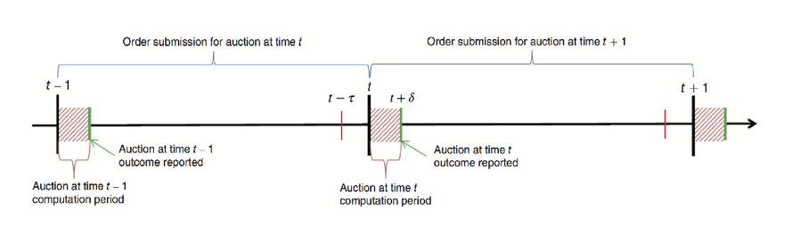
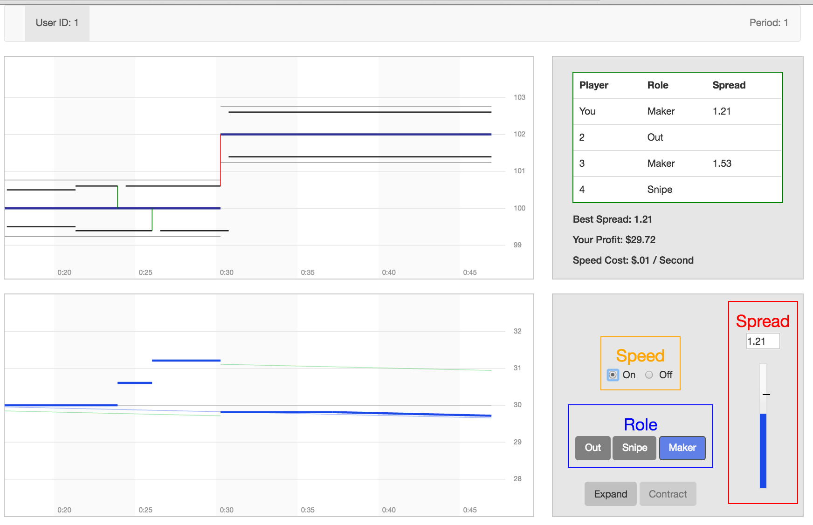
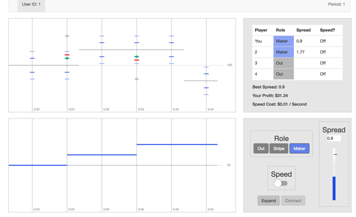

## Experiments in High-Frequency Trading 

Eric Aldrich,  Dan Friedman,  Kristian López-Vargas 
<!--Let's discuss scope of presentation (whole vs lab); Where do we mention Peter? etc-->

University of California, Santa Cruz

--------------------------------------------------------

## Outline

1. Motivation 
2. Research Plan
3. BCS Model
    <!--* Prediction-->
4. Laboratory Implementation (BCS) 
    <!--* CDA-->
    <!--* FBA -->
5. Pilot Sessions
    <!--* Design-->
    <!--* Results-->
6. Next Steps

--------------------------------------------------------

# Motivation 

--------------------------------------------------------

## Motivation 

* Trading latencies have rapidly declined from seconds to milliseconds and microseconds. 

* High-frequency trading (HFT) firms account for a large fraction of trades worldwide.

<!--Telecommunications technology and automated order placement has caused trading latencies to rapidly decline over the last decade from seconds to milliseconds and microseconds. Market floor specialists have disappeared, and high-frequency trading (HFT) firms now account for a large and increasing fraction of trades worldwide. -->

--------------------------------------------------------

## Motivation 

* Proponents: 

    * HFT increases market liquidity and reduces transaction costs. <!--maybe cite: Some academic studies ?-->

* Opponents: 

    * The multi-billion-dollar cost of HFT infrastructure is (indirectly) borne by ordinary investors.
    
    * HFT liquidity vanishes when most needed, destabilizing financial markets.

<!--Proponents of HFT claim that HFT has increased market liquidity and reduced transaction costs; and existing academic studies, on balance, tend to support that position. Opponents argue that the multi-billion-dollar cost of HFT infrastructure is indirectly borne by ordinary investors, that HFT liquidity vanishes when most needed, and that HFT could destabilize financial markets.-->

--------------------------------------------------------

## Motivation  

* Existing data are insufficient to resolve the controversy (gathered from a single format -- CDA).

* Policy makers and regulators worldwide are already implementing HFT-focused policies. 

* Experiments (lab and field) are a superior alternative to scientifically study and compare market formats in the presence of HFT.

<!--Our proposed research is motivated by two important facts. First, existing data are insufficient to resolve the controversies regarding the impact of HFT. The data are gathered from markets using only a single format, the continuous double auction (CDA). Therefore, counterfactuals can only be approximated, and alternative market institutions cannot be properly studied. Second, despite the inconclusive evidence, policy makers are already taking actions intended to discourage HFT. In 2014, New York City Attorney General launched a probe of HFT-related practices that resulted in a lawsuit against Barclays. In June 2016, the U.S. Securities and Exchange Commission approved a plan put forth by IEX to delay all incoming orders with the intention of reducing the advantage of HFT firms. Regulators around the world have started to make similar moves.-->

--------------------------------------------------------

# Research Plan

--------------------------------------------------------

##  Research Design

* We use experiments to compare relevant market formats.

* **Examine 4 formats**: Continuous Double Auction (CDA - widely used worldwide); three market alternatives (FBA, IEX, EBS). 

* **Two stages**: Laboratory (ongoing) and Field (open tournament - early stage).
 
* **Outcomes and metrics of performance**: liquidity, stability, and transactions costs.
 
<!--In this context, it is of vital importance to scientifically study policy and market alternatives in a controlled environment. We propose to study the impact of HFT using the experimental method to compare existing and alternative market formats, beginning in the laboratory and continuing in the field with a high profile, realistic tournament. We will study the performance of four main market formats in terms of liquidity, stability, and transactions costs. Our study will also help disclose whether the alternative formats raise unanticipated new issues.-->

--------------------------------------------------------

##  Market formats - CDA

* Baseline market format: the Continuous Double Auction (CDA) 

    * Organizes trade in nearly all major exchanges.
     
    * Orders are processed immediately with strict price-time priority 
 
    * => speed technology is crucial.
    
<!--The baseline market format is the Continuous Double Auction (CDA) which organizes trade in near all major exchanges around the world. Since under CDA trading occurs at any moment and orders are processed with price-time priority, speed technology is crucial.-->

--------------------------------------------------------

##  Market formats - Alternatives
     
* Three alternative formats attempt to reduce the incentives for speed.
   
    1. IEX: delays incoming orders by 350 $\mu$S, allows hidden, “pegged” orders;
    
    2. EBS: within a narrow time window, randomizes the sequence in which orders are processed;
     
    3. Frequent batch auction (FBA): equal priority to orders received in the same batch (e.g. a tenth of a second).
    
    <!-- We plan on studying four alternative formats that attempt to keep the virtues of CDA while changing these incentives for speed. We focus in three alternatives: 1) the IEX format which delays incoming orders by 350 microseconds but allows hidden, “pegged” orders; 2) the EBS format which, within a narrow time window, randomizes the sequence in which orders are processed; and 3) the frequent batch auction (FBA) which gives equal priority to all orders received in the same batch of, say, a tenth of a second.-->
    
-----------------------------------------------------------------------------------------------------------------------------------------------------------------------------------------------------------------------------------------------------------------------------------------------------------------------------------------------------------------------------------------------------------------------------------------------------------------------------------------------------------------------------------------

##  Project Stages 

This project has two phases:

1. Laboratory experiments:
    * Simple environments, adding relevant features of modern exchanges one at a time. 
    * Participants tune algorithms that place orders on their behalf. 
    
2. Public tournaments:
    * Hosted on a financial exchange that emulates modern equities exchanges.
    * State-of-the art communication protocols.
    * Participants: teams from industry and research institutions.

<!--The first phase consists of laboratory experiments, starting with simple environments and increasingly adding the relevant features of modern exchanges. Human participants will tune algorithms that submit orders to a financial exchange on their behalf. 
The second phase will consist of public tournaments hosted on a specially designed financial exchange that emulates leading U.S. equities exchanges endowed with state-of-the art communication protocols. Tournament participants will be teams from industry and research institutions.-->

--------------------------------------------------------

##  Project Status 

1. Developed simple laboratory environments
    * Based on Budish, Cramton and Shim (2015); BCS hereafter.
    * CDA and FBA

2. Conducted pilot experiments; very preliminary results.
    
3. Currently developing financial exchange.

--------------------------------------------------------

# BCS Model 

---------------------------------------------------------

## Model Primitives: Asset, Information

* One security $ x $, indivisible single units traded in continuous time.

* $ x $ can be costlessly liquidated at publicly observed fundamental value $ V(t) $. 
 
 <!--no asymmetric information, costs of inventory, etc "best case scenario for price discovery"-->

* $ V(t) $ evolves via compound Poisson with jump rate $ \lambda_V $ and jump distribution $ F_V $ 
<!--  Finite support; Symmetric with mean zero-->

* $ J $ is distribution of the jump size.  
<!--abs value of F_v realizations-->

---------------------------------------------------------

## Model Primitives: Investors and Trading Firms

<!--end users of financial markets: mutual funds, pension funds, hedge funds, etc. -->

* Investors (exogenous liquidity/noise traders):
    * Arrive randomly with fixed need to buy/sell 1 unit at a Poisson arrival rate of $ λ_I $. 
    * Trade immediately upon arrival: they are only takers of liquidity. 

* Trading Firms (HFTs, algorithmic traders, makers):
    * No intrinsic demand: profit/lose from trading at prices $ p \neq V(t) $.
    * Entry is endogenous.
    
* Latency: firms observe V with a small delay, $ \delta_{slow} > 0 $. At a cost $ c_{speed} $, they can reduce latency by $ \Delta\delta = \delta_{slow} - \delta_{fast} > 0 $ Wolog $\delta_{fast} = 0 $. 

--------------------------------------------------------

## Continuous Double Auction - CDA 

* Limit order: Buy(sell) 100 shares of APL at $100.00 or less (or more).
 
* Submission to the market at any time.

* Serial processing: orders processed one-at-a-time as they arrive.
 
* Limit order book: set of standing orders.

* Trade: when a new limit order arrives and (contains a bid ≥ lowest ask or an ask ≤ highest bid)

--------------------------------------------------------

## CDA in the BCS Model
 
* Strategies for trading firms (at any moment of trading day):

    1. _Exit_ the market.
    
    2. _Market maker_: chooses spread $[0, \bar{S}]$ (centered on $V$) and speed technology _{fast, slow}_.
        * Profits upon investor arrivals.
    
    3. _Sniper_: chooses speed technology _{fast, slow}_
        * Profits from value jumps and stale orders (see below). 

* Speed technology reduces latency at a cost of $c_{speed}$ per unit of time. 

<!--Players at any instant choose whether (a) to exit the market and earn a modest flow of income w (= 0 in our implementation), or to participate either as (b) a market maker or (c) a sniper. In the latter two cases players also choose whether to invest in a technology that reduces latency at cost cs per unit of time. 
A market maker chooses a spread  around the fundamental V ; by choosing s she automatically posts a bid at V - 0.5s and an ask at V + 0.5s. In the CDA she makes profit of 0.5s any time she has the smallest spread when an exogenous market order arrives. Her limit orders automatically track V with some fixed latency ; during that latency, the orders are stale in that they do not reflect the current fundamental value. By paying the cost of speed cs the market maker can reduce the latency to (without loss of generality for our purposes) zero. 
-->

---------------------------------------------------------

## Equilibrium of CDA in the BCS Model (main feature)
 
* No asymmetric info, no inventory costs, everyone risk neutral. Bertrand competition, but equilibrium spread > 0. 
 
* This is due to sniping incentives:
    
    * When $ V(t) $ jumps, the maker sends a replace order, and everyone else tries to buy (sell) the stale quote and liquidate at new fundamental ("snipe").
    
    * Sniping probability $ \frac{N-1}{N} $.
    
    * Sniping generates arbitrage rents paid by investors.

---------------------------------------------------------

## Equilibrium of CDA in the BCS Model (complete)

* Unique Nash Equilibrium (s\*, N\*).

* Investors trade immediately upon arrival.
 
* One trading firm is market maker: sets spread $ s^{*} $, orders tracking V(t).
 
* N − 1 trading firms are stale-quote snipers: submit IOC orders when V(t) jumps.
  
* Zero profit for market makers: 
$$ λ_I . \frac{s}{2} - λ_V.\Pr(J>\frac{s}{2}).\mathbb{E}( J-\frac{s}{2}|J>\frac{s}{2} ). \frac{N-1}{N} = c_{speed} $$

* Zero profit for snipers: 
$$ λ_V.\Pr(J>\frac{s}{2}).\mathbb{E}( J-\frac{s}{2}|J>\frac{s}{2} ). \frac{1}{N} = c_{speed} $$

<!--
    Simplifies to lambda_I s*/2 = N* c_speed:     
    "all of the expenditure by trading  rms on speed technology ultimately is borne by investors, via the bid-ask spread."..."Arms-race prize = expenditures on speed = cost to investors"
  
    * Equilibrium Condition Exo Entry: Revenue from investors = rents to trading firms. 
    $$ λ_I . \frac{s}{2} = λ_V.\Pr\[J>\frac{s}{2}\].\mathbb{E}( J-\frac{s}{2}|J>\frac{s}{2} ) $$
-->

---------------------------------------------------------

## Frequent Batch Auction - FBA 

* Orders are (still) continuously time-stamped.

* Trading day divided into many equal-length _submission stages_ (of length $ \tau $).
 
* At closing, all standing buy (sell) orders are combined to generate a stair-step demand (supply) curve.

* Market clearing (equilibrium) price $ p^\star $ is computed, and infra-marginal bids and asks are executed at a uniform price $ p^\star $.

<!---->
<!---->

<!--
 The messaging server still continuously relays time-stamped orders (and cancellations etc.) as usual. However, as illustrated in Figure 2, the FBA matching engine divides the trading day into many submission stages (or batching intervals) of equal length. It collects orders continuously but does not immediately process them. Instead, at the end of a submission stage, all new orders received (with positive latency, these must have been sent before , as indicated by the red tick in Figure 1) are combined with unfilled orders from previous stages. The FBA matching engine then generates a stair-step demand curve from the combined bids and a stair-step supply curve from the combined asks. If demand and supply do not intersect, then there is no trade and all orders carry over to the next batch auction, except those that entered the auction as immediate or cancel. 

If demand and supply do intersect, then the market clears where supply equals demand, i.e., all infra-marginal bids and asks are executed at a uniform price p* that clears the market. (The midpoint is used when there is an interval of market-clearing prices. A rationing rule, independent of time stamp within a batching interval, is used when there is an imbalance of supply and demand at a unique market clearing price.) At time t+delta the FBA matching engine notifies the messaging server of the executed trades and price p* (if demand and supply intersect) and the remaining order book.-->

--------------------------------------------------------

## FBA in the BCS Model

* As in CDA, a maker submits one sell (buy) limit order that tracks the fundamental + (-) a chosen spread $ s $.  

* A sniper's bot submits a limit buy (sell) at the newest $V(t)$ each _interval_ with a V-jump. 

* Snipers' orders automatically cancelled if not filled.

* Sniping profitable only when being _fast_ & there is a _slow_ maker & a jump occurs after $ T - \delta_{slow} $ and before $ T - \delta_{fast} $.
 
 <!---->
 <!--Note that such a snipe can be profitable only when (a) the sniper has purchased speed and at least one maker has not and (b) there is a sufficiently large jump in V within the last τ seconds of the batching period. The last condition suggests that sniping is less profitable in FBA than in CDA to the extent that τ is smaller than the batching interval.--> 

--------------------------------------------------------

## Equilibrium of FBA in the BCS Model
 
* Bertrand competition: Zero bid-ask spread.
    * For any $ \tau $ (batching length) > 0 (discont. between continuous/serial & discrete/batch).

* (Slow) trading firms supply $ \bar{Q} $ units of liquidity at zero spread.

* If $ \tau $ sufficiently larger than speed differential $ \Delta δ $ => no one invests in speed:

$$ \frac{\Delta\delta .\lambda_V}{\tau}.\mathbb{E}(J).\bar{Q} < c_{speed}  $$

<!--The fraction Deltaδ*λjump/tau  is the proportion of time which the fast trader has a profitable sniping opportunity. For finite Q, the condition is satisfied for long enough τ.-->

--------------------------------------------------------

# Laboratory Implementation

--------------------------------------------------------

## Basic Lab Environment
<!--This is a summary slide, the next four are the detail-->

* Simplest lab environment is adapted from BCS.
 
* A single asset, single exchange, price is continuous.

* The fundamental value $V(t)$: exogenous, compound Poisson process, jump rate $ λ_V $, jump distribution $F_V$.
 
* Automated investors: exogenous stream of market buy/sell orders, Poisson arrival rates $λ_I$.

* Traders control bots/algorithms which place orders on their behalf, conditional on market conditions and strategies ({out, making/spread, sniping}, {fast, slow})
 

<!-- The simplest lab environment is adapted from BCS. A single asset is traded on a single exchange, and price is a continuous variable. The fundamental value V(t) is determined exogenously by a compound Poisson process with arrival rate λ_V and jump distribution F_V. Players’ profit opportunities come from “investors” represented by an exogenous stream of unit market orders to buy (limit price very high) and to sell (limit price 0) with Poisson arrival rates λ_B=λ_S=λ_I.-->

--------------------------------------------------------

## Laboratory Implementation: CDA

<!---->

<!--Eric, the options for resizing in reveal.js depend on the available extensions and markdown "version" [ideas?]-->

<!--Layout Legend: 
CDA user interface in BCS environment. Traders use the action box (bottom right) to adjust choices at any moment during the trading period. To (re)enter as a market maker she clicks the “maker” button or just drags the “Spread” bar to adjust s. To (re)enter as a sniper, she clicks the “snipe” button. By clicking the “Out” button, a player cancels any limit orders, deactivates sniping bots and unsubscribes from speed services. The event history box (top left) displays the time path of the fundamental value V(t) as a piecewise constant blue line, the trader’s own bid and ask as black horizontal lines, investor transactions as green vertical lines, snipe events as red vertical lines, and other traders’ limit orders as gray horizontal lines. The information box (top right) displays the current bid-ask spread, other traders’ status and the cost of speed cs. The profit history box (bottom left) displays players’ accumulated profit at each moment of time.-->

<!--Figure Events Legend: 
The event history box indicates that player 1 is about 48 seconds into the trading day, and has been a maker for at least 30 seconds. Her current spread of 1.21 is the best (smallest) of the two current makers. Investors arrived around seconds 23 and 26 with market orders to buy and sell, respectively. The green vertical lines in the event history box at those times, and the corresponding upward jumps in the profit history box, show her resulting profit. Around second 30, V jumped from about 100 to 102 and player got sniped by player 4, reflected in the red vertical line connecting the stale quote to the new V and the corresponding drop in profit. Note that profit is flat between events if “Speed” is turned off, but has a slight negative slope (of cs) when “Speed” is activated.
-->

--------------------------------------------------------

## Laboratory Implementation: FBA 

<!---->

<!--Figure Layout Legend: FBA user interface in basic BCS environment. The action box, information box and profit history box are essentially the same as in Figure 2. In the event history box (top left), the thin black horizontal line segments depict V(t), and the gray vertical lines separate the 5-second batching intervals. The color-coded ticks depict the order book at auction times: blue for own orders, lighter blue for other traders’ orders and light purple for investors. Trader 1’s own filled orders (and those of other traders) are indicated by a green (gray) dot behind the corresponding tick. The red tick shows the clearing price.-->
<!--Play / Events Legend:
 Total time 48 seconds. A buying investor arrived during the batching interval [20,25), and a selling investor arrived during the batching interval [30,35). In both batches, trader 1 had the best spread (at 0.9) and had an order filled profitably. 
 Snipers not depicted in the figure. -->

--------------------------------------------------------

# Pilot Experiments

--------------------------------------------------------

## Pilot Experiment: Setting   

* Redwood II interface

* Two market formats: CDA and FBA 

    * Three trading days (periods), five-minutes each.

    * In each period, two markets with four traders each. 
    
* Session lasted approx 100 minutes.

--------------------------------------------------------

## Pilot Experiment: Design    

* Exogenous processes: 
    
    * Stochastic realizations using
    
        - $λ_V=4$: Fundamental value jumps once every 4 seconds. Using historical data on the SPY ETF, this means a 5-minute lab session corresponds to about 1.5 minutes of actual market trading.
        
        - $λ_I= 3$: Investor arrivals once every 3 seconds.
        
        - $V_0 = 100$: Order of magnitude equal to most liquid equities.
        
        - $F_V = N(0,0.5)$: Standard deviation is relatively large to price increments in data, but the magnitude is arbitrary if subjects can scale spreads accordingly.
        
        - $c_s=\\$0.01/s$: Roughly twice the cost (per symbol, per second of a trading day) for a premier microwave service.
        
        - $ \delta_{slow} = 0.5s $: About 10 times larger than actual Chicago -> NY latency, after accounting for our time scaling.
    
    * Realizations matched across groups and formats.

* In FBA, batch interval was 5 secs (1.25 secs, market time); reporting lag was essentially zero; default latency / interval = 0.1.

<!--(In our pilot experiment, the ratio is 0.5/5 = 0.10; in more realistic settings it might be closer to 0.01.)
<!--On August 10, 2016 we conducted a pilot experiment with a Redwood II prototype of CDA and FBA matching engines, using the interfaces shown in Figures 2 and 3. In each format, two groups of four players each completed three five-minute periods. Each period, stochastic realizations using λ_V= 4, λ_B=λ_S=λ_I= 3, F_V  = N(0,0.5), cs=$0.01/sec, τ = 0.5 sec and initial V = 100 were matched across groups and formats; each trading period here roughly translates to a 80 second segment on the NASDAQ OMX exchange for the high-volume SPY contract. In FBA, the batching interval was 5 seconds and the reporting lag was essentially zero.-->
<!--We found a weak uptrend for snipers in CDA, but the share never exceeded 43%; in equilibrium of the BCS model the sniper share is 75%. In FBA the sniper share trended down, as predicted in BCS equilibrium, and fell below 20% in period 3. Almost all other players were makers; Out shares were always miniscule. The share of traders choosing speed trended up in CDA as predicted, reaching almost ⅔ in period 3, and trended down (also consistent with prediction) in FBA, falling to 11% in period 3. -->

<!--(In our pilot experiment, the ratio is 0.5/5 = 0.10; in more realistic settings it might be closer to 0.01.)-->
    

--------------------------------------------------------

## Pilot Experiment: Results

* Almost all players were trading, _Out_ shares were always very small.

* The share of traders as snipers:
    * Weak uptrend in CDA; never exceeded 43% (eqm share = 75%). 
    * Trended down in FBA, below 20% in period 3 (eqm share = 0)
      
* The share of traders choosing speed:
    * trended up in CDA (as predicted) reaching ~⅔ in period 3, 
    * trended down (as predicted) in FBA, falling to 11% in period 3. 

--------------------------------------------------------

## Pilot Experiment: Results

* Performance metrics: transactions cost and informational efficiency.
    * Observed mean spread in period 3: FBA: 0.22%; CDA: 0.41%.
    * Predicted mean spread 0% and 0.32%, respectively; 

* FBA was also more informationally efficient: 
    * CDA markets had higher RMSE than FBA market
    * In period 3, CDA: 0.42% and FBA: 0.32%. 

<!--We found a weak uptrend for snipers in CDA, but the share never exceeded 43%; in equilibrium of the BCS model the sniper share is 75%. In FBA the sniper share trended down, as predicted in BCS equilibrium, and fell below 20% in period 3. Almost all other players were makers; Out shares were always miniscule. The share of traders choosing speed trended up in CDA as predicted, reaching almost ⅔ in period 3, and trended down (also consistent with prediction) in FBA, falling to 11% in period 3. -->

<!--The relevant performance metrics here are for transactions cost and informational efficiency; long-run stability issues are less relevant in this simple stylized environment.  Mean spread in FBA period 3 was only 0.22% vs 0.41% in CDA, both in the neighborhood of the predicted 0% and 0.32%, respectively; and overall mean spreads were only about 0.10% higher. FBA was also more informationally efficient: in every period, both CDA markets had higher RMSE than either FBA market; the period 3 averages were about 0.42% in CDA and 0.32% in FBA. -->

----------------------------------------------------

## Summary Results 

| | MAKER | SNIPE | Speed | Mean Spread | NumTrades | RMSE |
| --- | :---: | :---: | :---: | :---: | :---: | :---: |
| **CDA** | | | | | | |
|1st Period | 63.5% | 33.8% | 43.2% | 0.80 | 109.5 | 0.50% |
|2nd Period | 62.2% | 35.5% | 53.5% | 0.46 | 140.5 | 0.37% |
|3rd Period | 60.0% | 38.3% | 66.0% | 0.40 | 158.0 | 0.39% |
| **FBA** | | | | | | |
|1st Period | 66.9% | 31.9% | 28.5% | 0.44 | 87.5 | 0.42% |
|2nd Period | 74.2% | 25.0% | 22.3% | 0.25 | 85.0 | 0.26% |
|3rd Period | 79.9% | 19.4% | 11.1% | 0.21 | 91.0 | 0.30% |

--------------------------------------------------------

# Next Steps

--------------------------------------------------------

## Production Experiments: 

* Results are interesting but far from conclusive.
 
* We will run production sessions with these and other parameter configurations, (e.g. stressful periods), and robustness checks (e.g. not showing other traders’ speed status or spread) etc.
 
* More importantly, we are implementing IEX and EBS variants of the CDA.
 
* We need feedback!

<!--These pilot results are encouraging but far from conclusive. More replications of the current setup, sessions with other parameter configurations (e.g. stressful periods), and robustness checks (e.g. not showing other traders’ speed status or spread) are needed. Of course, we must also implement the IEX and EBS variants of the CDA. -->

--------------------------------------------------------

## More Realistic Environments 

1. Variable and asymmetric arrival intensities and jump distributions. 

2. Latent fundamental.
 
3. Discrete price grid.
 
4. Historical order flow.
 
5. Fragmented markets and exchange competition.
 
6. Automated market makers and investors. 

<!--Most importantly, we must go beyond the simple BCS environment with more realistic features as follows. -->
<!--Variable and asymmetric arrival intensities and jump distributions. The Poisson parameter λ_V  can change exogenously during a trading period, and the market buy and sell parameters can take distinct values so that λ_B≠λ_S. The jump distribution can also shift during the trading period. -->
<!--Latent fundamental. In the simplest environment, traders automatically and immediately liquidate their positions at the known fundamental value V. In more realistic environments, V is not observed, and is an implicit function of the unannounced parameters for the compound Poisson processes generating buy and sell limit orders. Traders cannot lock in profit with a single transaction. Instead, they must earn their profits by round trip transactions. Implementation will require several minor changes in the user interface.-->
<!--Discrete price grid. Typical microstructure models allow the bid-ask spread to be determined endogenously. In practice, regulatory authorities set the minimum spread and price grid increment, or tick. By imposing a discrete price grid, we expect to see behavior more like that in contemporary financial markets: order books with positive quantities at several adjacent prices, placed by many different traders. -->
<!--Historical order flow. Instead of experimenter-specified parameters governing exogenous streams of limit orders, those streams will be adapted from historical data from the NYSE or other exchanges. That will allow us to compare the performance of various market formats in times known to be stressful as well as in normal times. -->
<!--Fragmented markets and exchange competition. An asset can be traded in two different exchanges, both using the same format, but possibly with different tick sizes. Information revealing something about the fundamental value might appear primarily or entirely in one of the exchanges, mimicking the environment that has resulted in cross-market latency arbitrage by high-frequency traders.  Alternatively, traders could trade on two different exchanges with equal information but different formats. Traders may (or may not) choose to migrate to the exchange that has endogenously lower trading costs.-->
<!--Automated market makers and investors. Human players will compete against pre-programmed bots acting as investors, market makers and/or snipers. (Earlier features blur the artificial distinction between investors, snipers and makers, and bots will eliminate those distinctions.) Bot-only simulations can be used to establish benchmark predictions in environments intractable to analytic methods. Pitting single humans against programmed equilibrium strategies is a useful diagnostic technique when the basic treatments yield puzzling departures from equilibrium. We will also see how groups of humans fare against bots that react to, e.g., recent measures of risk and return, or that implement ‘momentum ignition” or “front-running” strategies. -->

--------------------------------------------------

##  Discussion:

* Evidence from the laboratory and tournaments will provide knowledge to improve the design of financial markets.

* Research infrastructure will be a contribution for future research. 

<!--Exploring these differing environments will contribute to fundamental knowledge regarding financial market design. By introducing features one at a time, we will make strong inferences about which environmental aspects shape observed outcomes. By holding constant the realized stochastic process across market formats in any given environment, we can draw causal conclusions regarding comparative performance. For example, we will be able to make clear statements such as “relative to the basic CDA baseline, the IEX format lowers trading cost by 5-8% in normal environment X, but increases value-at-risk by 20-30% in stressful environment Y.” Such statements should help focus conventional econometric analysis of market data, and even by themselves should be helpful for regulators and exchange officials. -->

<!--We have started the lab stage developing simple environments that allow for HFT. Our current progress and preliminary evidence are encouraging on the feasibility of the project and and the quality of the collected evidence. Further evidence from the laboratory and the implementation of tournaments will constitute valuable scientific knowledge on which formats best promote financial market liquidity and stability and, thus, help improve the design of financial markets. Our research infrastructure will be an important contribution for future research on financial market design. -->

--------------------------------------------------

##  Thanks to: 

* Center for Analytical Finance.

* Undergraduate programmers, Morgan Grant and Zach Petersen.

* University of Maryland postdocs, Darrell Hoy and David Malec.

<!--

DRAFT ZONE 

--------------------------------------------------------

--------------------------------------------------------

## Continuous Double Auction - CDA 

* A _maker_ profits when an investor arrives and executes against her buy/sell order.

* A _sniper_ profits only when $V(t)$ jumps and there are stale orders in the book.

* A _Maker_ loses when her stale offers get executed upon a $V(t)$ jump (gets sniped) 

* All _fast_ (low latency) players have equal chance of being first to respond to any change in $V(t)$. 

<!-- sniping gains/loses are conditional to $\Delta V(t)$ exceeding the (smallest) 0.5s set by a market maker. 
If one of the snipers is first, then he makes (and the market maker loses) 0.5s. -->
      

